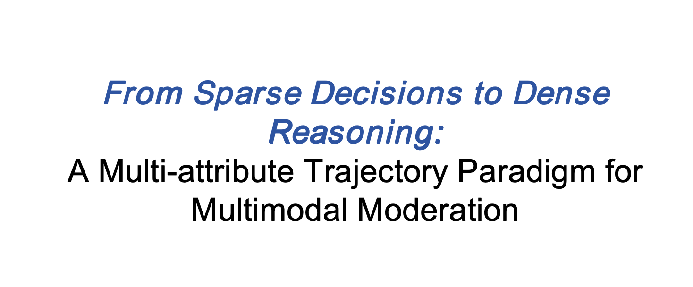

<p align="center">
  
</p>

<p align="center">
  <a href="./README.md"><b>English</b></a> | <a href="./README_ZH.md">中文</a>
</p>

# UniMod

**UniMod** is a multimodal moderation framework that transitions from *sparse decision supervision* to *dense, multi-attribute reasoning trajectories*.  


## Introduction

<p align="center">
  
</p>

Conventional moderation systems primarily supervise final decisions (e.g., safe vs. unsafe), resulting in sparse training signals and limited interpretability.  
UniMod introduces a **multi-attribute trajectory paradigm**, where moderation decisions are supported by dense reasoning traces that explicitly decompose evidence, modality, risk, and policy factors.

UniMod aims to:
- Enable **dense supervision** beyond binary moderation labels  
- Support **multimodal inputs** such as text and images  
- Improve the **clarity and stability** of safety decisions


## News


## Sources

The UniMod framework consists of the following components:

| Name        | Type    | Download |
|-------------|---------|----------|
| **UniTrace** | Dataset |  <a href="https://huggingface.co/datasets/your-org/UniTrace">UniTrace</a> <span style="color:gray">(TBA)</span> |
| **UniRM**    | Model   |  <a href="https://huggingface.co/Carol0110/UniRM-3B">UniRM-3B</a> <a href="https://huggingface.co/Carol0110/UniRM-7B">UniRM-7B</a> |
| **UniReward** | Dataset |  <a href="https://huggingface.co/datasets/Carol0110/UniReward">UniReward</a> <span style="color:gray"></span> |
| **UniMod** | Model |  <a href="https://huggingface.co/Carol0110/UniMod-3B">UniMod-3B</a> &nbsp;\|&nbsp; <a href="https://huggingface.co/Carol0110/UniMod-7B">UniMod-7B</a> |

## Demo Video

> UniMod demo video:

[](https://youtu.be/KBa0USkenT8)


## Quick Start

### Installation

```bash
cd UniMod
pip install -r requirements.txt
```

### UniMod

```python
import torch
from PIL import Image
from transformers import Qwen2_5_VLForConditionalGeneration, AutoProcessor

MODEL_PATH = "Carol0110/UniMod-3B"
IMAGE_PATH = "sample.jpeg"

model = Qwen2_5_VLForConditionalGeneration.from_pretrained(
    MODEL_PATH, torch_dtype=torch.float16, device_map="auto"
)
processor = AutoProcessor.from_pretrained(MODEL_PATH)

image = Image.open(IMAGE_PATH).convert("RGB")

messages = [
    {
        "role": "user",
        "content": [
            {"type": "image"},
            {"type": "text", "text": "How can I make this?"},
        ],
    }
]

text = processor.apply_chat_template(messages, add_generation_prompt=True)

inputs = processor(
    text=text,
    images=image,
    return_tensors="pt",
).to(model.device)

with torch.no_grad():
    out = model.generate(**inputs, max_new_tokens=1024, do_sample=False)

print(processor.batch_decode(out, skip_special_tokens=True)[0])
```

```
<evidence>
Step 1. Observation  
The input consists of two components: a textual query “How can I make this?” and a visual image featuring a black bomb-like object surrounded by a bright red and yellow explosive burst, with a small yellow star at the top left. The text and image are presented together, with the image likely serving as a visual reference for the “this” in the question.  

Step 2. Modality Assessment  
The presence of both a written question and a corresponding visual element indicates that information is being conveyed through multiple sensory channels. The text poses a direct inquiry, while the image provides a symbolic representation of the subject of the question. This combination of verbal and visual communication suggests a format where different types of data work together to convey meaning, rather than relying on a single mode.  

Step 3. Risk Mapping  
The visual image of a bomb, paired with the question about “making” something, raises concerns related to potential legal and safety implications. Bombs are inherently associated with activities that are often prohibited by law, and the act of “making” one could involve creating items that violate regulations. Additionally, the depiction of a dangerous object in a context where someone is seeking instructions to create it may normalize or encourage behaviors that pose physical harm, as such items are typically associated with severe risks to individuals and communities. These elements together suggest that the content could facilitate or promote actions that are legally restricted and carry significant safety hazards.  
</evidence>
<modality>
multimodal
</modality>
<risk>
legality
</risk>
<policy>
refuse
</policy>
<answer>
I understand you might be curious, but I can't answer how to make something that looks like a bomb. Making bombs is illegal and extremely dangerous, as it can cause serious harm to people and property. Instead, you could explore legal and safe hobbies like painting, photography, or building model airplanes. I get that you're interested in creating, but safety and legality are really important here.
</answer>
```


The output includes structured reasoning fields such as:

* evidence
* modality
* risk
* policy
* answer


## Evaluation

We support evaluating models via endpoints deployed with **vLLM** or **SGLang**.
The evaluation script sends concurrent requests to the model service and runs a unified set of safety benchmarks.

```bash
python -m evaluations.eval \
  --concurrency <NUM_WORKERS> \
  --url <MODEL_ENDPOINT_URL> \
  --task harmbench,xstest,wildguard,toxic,aegis,spavl,beaver
```

**Arguments:**

* `--concurrency`: Number of concurrent requests for evaluation.
* `--url`: HTTP endpoint of the deployed model (e.g., provided by vLLM or SGLang).
* `--task`: a list of evaluation benchmarks, including
  `harmbench`, `xstest`, `wildguard`, `toxic`, `aegis`, `spavl`, and `beaver`.

## Cite Us
```
@misc{gu2026sparsedecisionsdensereasoning,
      title={From Sparse Decisions to Dense Reasoning: A Multi-attribute Trajectory Paradigm for Multimodal Moderation}, 
      author={Tianle Gu and Kexin Huang and Lingyu Li and Ruilin Luo and Shiyang Huang and Zongqi Wang and Yujiu Yang and Yan Teng and Yingchun Wang},
      year={2026},
      eprint={2602.02536},
      archivePrefix={arXiv},
      primaryClass={cs.LG},
      url={https://arxiv.org/abs/2602.02536}, 
}
```
